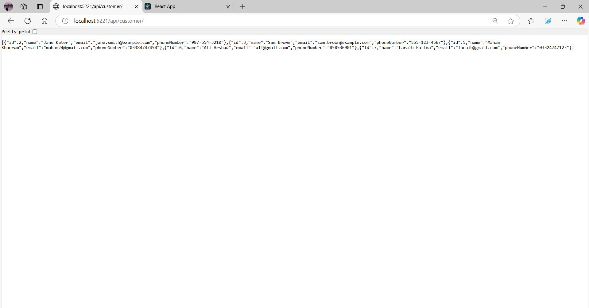

# CRM System

This project is a Customer Relationship Management (CRM) System built using **ASP.NET Core** for the backend and **React** for the frontend. It allows users to create, view, update, and delete customer information. The application supports a RESTful API with the backend serving as an API provider, and the frontend consumes this API to display and manage customer data.

## Table of Contents
- [Technologies Used](#technologies-used)
- [Folder Structure](#folder-structure)
- [Frontend (React)](#frontend-react)
- [Backend (ASP.NET Core)](#backend-aspnet-core)
- [How to Run](#how-to-run)

- [Demo Screenshots](#demo-screenshots)
- [License](#license)
- [Author](#author)

## Technologies Used

### Frontend:
- **React.js** for building the user interface (UI)
- **Axios** for making HTTP requests to the backend API
- **React Router** for navigation between pages
- **CSS** for styling

### Backend:
- **ASP.NET Core** with **Entity Framework Core (EF Core)**
- **SQLite** as the database to store customer data

## Folder Structure
- **`crm-frontend/`**: This is the folder where the React application resides. All frontend code (components, styles, assets) will be here.
- **`CRMSystem/`**: This is the folder where the ASP.NET Core API is located. It contains the controllers, models, and the database context.
- **`public/`**: Stores static assets like images (e.g., logo.png) and favicon.
- **`src/`**: This is where all the React components and related files (styles, assets) are stored.


## Frontend (React)

The frontend of this project is built using **React**. It communicates with the **ASP.NET Core** API to handle customer data.

### Features:
- **Customer List**: Displays a list of all customers.
- **Add Customer**: Allows users to add a new customer.
- **Edit Customer**: Allows users to edit customer details.
- **Delete Customer**: Allows users to delete customers from the database.
- **Routing**: The app uses **React Router** for navigation between pages.

### How it Works:
1. When you visit the application, the **WelcomePage** component loads first.
2. The **CustomerList** page displays a table with customer details and offers the ability to add, edit, or delete customers.
3. The **AddCustomer** and **EditCustomer** pages allow users to add and update customer information, respectively.
4. All actions are handled through API calls to the **ASP.NET Core** backend.

## Backend (ASP.NET Core)

The backend of this project is built using **ASP.NET Core**. It provides a RESTful API for handling customer data and interacting with the **SQLite** database.

### Key Files and Features:
- **CRMContext.cs**: This file contains the `DbContext` for connecting to the **SQLite** database. It defines the `DbSet<Customer>` to perform CRUD operations.
- **CustomerController.cs**: This API controller handles all customer-related operations (GET, POST, PUT, DELETE).
- **Program.cs**: This file sets up services like **CORS**, **EF Core**, and the routing for API endpoints.

### Database:
- **SQLite** is used for storing customer information.
- Customers have `id`, `name`, `email`, and `phoneNumber` properties.
- The API supports CRUD operations for managing customer records.


## How to Run

### Running Backend (ASP.NET Core):
1. **Open the first console** and navigate to the `crm-backend/` folder.
2. **Restore dependencies**: Run the following command:
   ```bash
   dotnet restore
   ```
3. **Run the backend API**: After the dependencies are restored, start the backend by running:
   ```bash
   dotnet run
   ```
   The backend will be running at [http://localhost:5221](http://localhost:5221).

### Running Frontend (React):
1. **Open the second console** and navigate to the `crm-frontend/` folder.
2. **Install dependencies**: Run the following command to install the necessary dependencies:
   ```bash
   npm install
   ```
3. **Run the React app**: After the dependencies are installed, start the frontend by running:
   ```bash
   npm start
   ```
   The frontend will be running at [http://localhost:3000](http://localhost:3000).
   
   -Note: Open two terminals simultaneously. First run backend, then run frontend.

### Additional Steps:
- Open your browser and visit [http://localhost:3000](http://localhost:3000) to view the application.
- Make sure both the backend and frontend are running.


## Demo Screenshots

1. **Welcome Page**  
   

2. **Customer List Page**  
   

3. **Add Customer Form**  
   

4. **Edit Customer Form**  
   
   


5. **Popup Success Message**  
   

6. **Delete Customer**  
   
   
7. **Backend Route Example**  
      
      


## License
This project is licensed under the MIT License - see the LICENSE file for details.

## Author
**Maham Khurram**